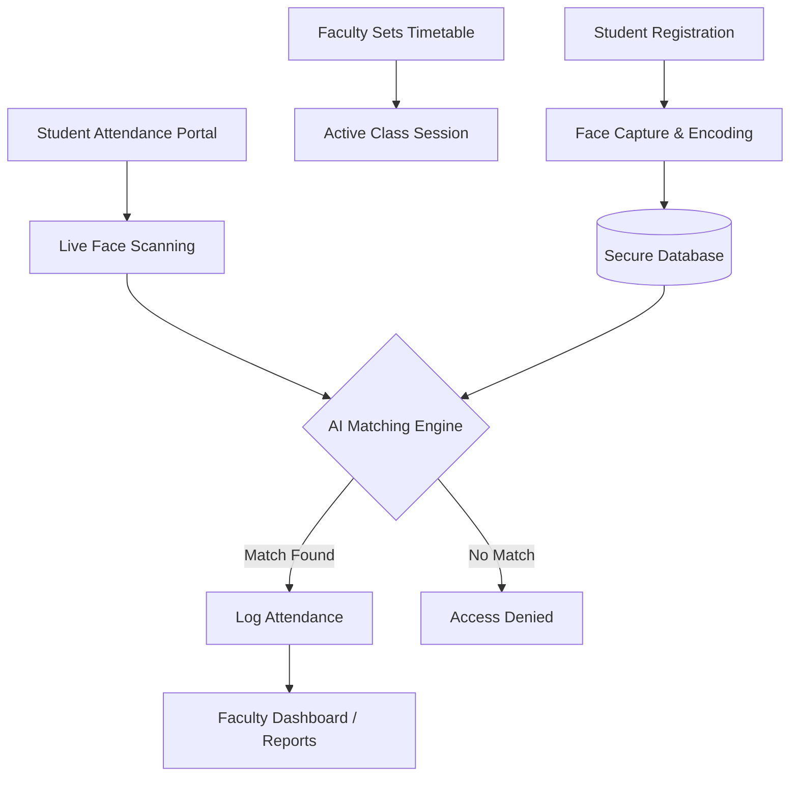

# Automated Face Recognition Attendance System

A state-of-the-art, AI-powered attendance management solution built with Next.js. This system eliminates manual roll-calls by leveraging facial recognition technology to identify students and record attendance in real-time.

---

## 📽️ Project Flow

The system operates through a synchronized workflow between Students, Faculty, and the AI Engine.

### 1. Student Onboarding & Registration
- Students register their profiles and provide high-quality facial captures.
- The system extracts unique **Facial Descriptors** (embeddings) from these images using `face-api.js`.
- These descriptors are stored securely in the database, associated with the student's Roll Number.

### 2. Faculty Management
- Faculty members manage the **Dynamic Timetable**, defining slots for courses each day.
- They can initiate a "Session" for a specific class or let the system automatically validate attendance based on the current time and slot.

### 3. Real-Time Attendance Marking
- Students access the attendance portal during their scheduled class time.
- The system activates the webcam and performs real-time detection.
- **Matching Engine**: The live facial descriptors are compared against the stored library using a Euclidean distance threshold.
- If a match is successful, the student's attendance is instantly logged for that specific course and slot.

### 4. Absence Justification & Analytics
- Students can view their attendance history and submit **Justifications** for missed classes.
- Faculty can review justifications, manually override statuses, and generate comprehensive **Analytics Dashboards** and **Excel Reports**.

#### 🔄 System Flow Diagram


---

## 🛠️ Tech Stack by Aspect

### **1. Core Framework & Frontend**
- **Next.js 16 (App Router)**: High-performance React framework for server-side rendering and routing.
- **React 19**: Modern UI library for building interactive components.
- **Vanilla CSS (Glassmorphism)**: Custom, premium styling for a sleek, translucent user interface.
- **Lucide React**: For beautiful, consistent iconography.
- **Recharts**: Interactive data visualization for attendance trends and statistics.

### **2. AI & Computer Vision**
- **face-api.js**: A high-level JavaScript API for face detection and recognition built on TensorFlow.js.
- **SSD Mobilenet v1**: Used for accurate face detection.
- **Face Landmark 68**: For precise facial feature mapping.
- **Face Recognition Model**: To generate and compare facial embeddings.

### **3. Backend & Data Layer**
- **Node.js**: Server-side runtime environment.
- **Prisma ORM**: Next-generation Node.js and TypeScript ORM for database management.
- **SQLite**: Lightweight, relational database for robust data persistence.
- **XLSX**: Library for generating and exporting student attendance records to Excel.

### **4. Security & Authentication**
- **NextAuth.js**: Comprehensive authentication solution for Next.js.
- **Bcrypt**: For industry-standard password hashing and security.
- **Role-Based Access Control (RBAC)**: Distinct permissions and views for Students and Faculty.

---

## 🚀 Installation Guide

Follow these steps to deploy the project on your local environment.

### 📋 Prerequisites
- **Node.js**: Version 18.20.0 or higher.
- **npm**: Version 10.x or higher.
- **Webcam**: Required for the facial recognition features.

### 🔧 Step-by-Step Setup

1. **Install Dependencies**
   ```bash
   npm install
   ```

2. **Initialize Database Client**
   ```bash
   npm exec prisma generate
   ```

3. **Run the Development Server**
   ```bash
   npm run dev
   ```

---

### 🌐 Accessing the App
Open [http://localhost:3000](http://localhost:3000) in your browser.


---

## 📈 Key Features
- ✅ **Touchless Attendance**: Automated marking with 99%+ accuracy.
- ✅ **Dynamic Scheduling**: Flexible timetable management for faculty.
- ✅ **AI Justifications**: Intelligent handling of student absence requests.
- ✅ **Detailed Reporting**: Exportable attendance data for administrative use.
- ✅ **Responsive UI**: Optimized for both desktop and tablet use for ease of use in classrooms.

---

